# 3.2. Architecture

An ICM workspace is a folder. Inside it, agents navigate a five-layer context hierarchy (Figure 1).

*Figure 1. The five-layer context hierarchy. Layers 0–2 provide structural routing and stage instructions. Layers 3 and 4 carry content: Layer 3 holds reference material (the factory), stable across runs; Layer 4 holds working artifacts (the product), unique to each run.*

Layer 0 is the global identity file. It tells the agent which workspace it is in, what the folder structure contains, and where to find things. Layer 1 is workspace-level task routing: given what the user wants to do, which stage handles it, and what shared resources exist across stages. Layer 2 is stage-specific: the contract that defines inputs, process, and outputs for one step of the workflow.

Layers 3 and 4 are both content that the agent loads while executing a stage, but they represent fundamentally different kinds of context.

Layer 3 is reference material: design systems, voice rules, build conventions, style guides, domain knowledge bundled as skill files. These files are configured once during workspace setup and remain stable across every run of the pipeline. They are the factory.[^3] Layer 4 is working artifacts: the output of the previous stage, user-provided source material, anything specific to this particular run of the pipeline. These files are produced and consumed during execution and change every time.

The distinction matters for how the model processes context. Layer 3 material needs to be internalized as constraints and patterns: the model should write *like this*, use *these colors*, follow *these conventions*. Layer 4 material needs to be processed as input: the model should transform *this research* into a script, or convert *this script* into a visual specification. Mixing persistent rules with per-run artifacts in an undifferentiated context window forces the model to sort them on its own. Separating them in the folder structure means the model receives already-organized context.

**Table 2.** Layer 3 (reference material) versus Layer 4 (working artifacts).

|  |  Layer 3: Reference  |  Layer 4: Working  |
| --- | --- | --- |
|  Changes between runs  |  No  |  Yes  |
|  Example files  |  voice.md, design-system.md, conventions.md  |  research-output.md, script-draft.md  |
|  Model should  |  Internalize as constraints  |  Process as input  |
|  Configured during  |  Workspace setup (once)  |  Pipeline execution (each run)  |
|  Folder location  |  references/, _config/, shared/  |  output/  |
|  Analogy  |  The recipe  |  The ingredients  |

A rendering agent might only need Layers 0 through 2. A script-writing agent reads down to Layer 4 to access both the voice rules (Layer 3) and the source material (Layer 4). No agent reads everything. This keeps token cost low and context focused, and it avoids the degradation that Liu et al. documented when models process long contexts full of irrelevant material (25).

The folder structure for a typical workspace is shown in Figure 2.

*Figure 2. Folder structure of a typical ICM workspace, with layer annotations. Files and folders are color-coded by their role in the context hierarchy. Layer 3 material (reference) persists across runs. Layer 4 material (working artifacts) changes each time the pipeline executes.*

The numbering encodes execution order. The folder boundaries enforce separation of concerns. The `output/` directories are the Layer 4 handoff points: the output of stage 01 becomes available as input to stage 02. If a human edits a file in `01_research/output/` before running stage 02, the agent picks up the edited version. The `references/` directories and `_config/` folder hold Layer 3 material: the stable knowledge and constraints that persist across runs.

Layer 2 is the control point of the entire system. Each stage contract includes an Inputs table that specifies exactly which files from Layers 3 and 4 the agent should load, and which sections of those files are relevant.[^4] Without this scoping mechanism, an agent would either load everything in the workspace or rely on its own judgment about what matters. The Inputs table makes the selection explicit, editable, and auditable.

This is the filesystem doing the work that a framework would otherwise do in code. Stage sequencing is the folder numbering. Context scoping is the folder hierarchy. State management is the files on disk. Coordination between stages is one folder’s output being another folder’s input.

From the model’s perspective, this layered loading changes the composition of the context window at each stage. Layers 0 through 2 together contribute roughly 1,300 to 1,600 tokens of identity, routing, and stage-specific instruction. Layer 3 adds reference material scoped to the current stage, typically 500 to 2,000 tokens depending on how many conventions and guidelines apply. Layer 4 adds the working material for this run, a research document, a script, a specification, which varies with the content but rarely exceeds a few thousand tokens when the previous stage has done its job of condensing and structuring. The total context delivered to the model at any given stage typically ranges from 2,000 to 8,000 tokens, well within the range where current models perform at their best. Figure 3 illustrates this composition across three example stages and contrasts it with a monolithic approach.

*Figure 3. Context window composition by stage (representative token counts from the script-to-animation workspace). The three ICM stages each deliver 2,000–8,000 focused tokens. A monolithic approach loading all stages’ instructions, all reference material, and all prior outputs produces a context window exceeding 40,000 tokens, most of it irrelevant to the current task.*

Contrast this with a monolithic approach where all stage instructions, all reference files, and all prior outputs are loaded into a single prompt. That approach can easily reach 30,000 to 50,000 tokens, pushing into the range where Liu et al. found significant performance degradation on information retrieval tasks (25). The “unused/irrelevant context” segment in the monolithic bar of Figure 3 represents tokens from stages other than the one currently executing: instructions the agent will not follow during this step, reference material that applies to a different stage, and prior outputs already consumed by earlier stages. In ICM, these tokens are never loaded. In a monolithic prompt, they occupy context space without contributing to the current task. The compression research by Jiang et al. (31, 32) addresses this problem after the fact. ICM’s architecture avoids it by construction: each stage receives a focused, appropriately sized context window because the folder structure determines what gets loaded.

Richard Gabriel argued that systems prioritizing simplicity of implementation over feature completeness tend to survive and spread, because they are easier to port, easier to understand, and easier to improve incrementally (11). ICM trades the flexibility of a programmatic orchestrator for the portability, inspectability, and editability of plain files. That tradeoff is the point.

In the same spirit, Plan 9 from Bell Labs extended Unix’s “everything is a file” principle to its full conclusion, representing all system resources as files in per-process namespaces (12). ICM applies the same idea to AI workflows: all state, all context, all instructions exist as files in a folder namespace.

[^3]: This connects to the fifth design principle: configure the factory, not the product. Layer 3 is the factory configuration. Layer 4 is what the factory produces each time it runs.
[^4]: Larger reference collections can include their own routing files, a CONTEXT.md within a configuration or design system folder, that help agents navigate to the right content within the collection. This is the routing pattern from Layer 1 applied recursively within Layer 3.
