# 3.3. Stage Contracts and Handoffs

Figure 4 illustrates the flow between stages. Each stage reads from the previous stage’s output folder, processes it according to its own contract, and writes to its own output folder. At each boundary, the human can inspect and edit the output before the next stage runs.



*Figure 4. Pipeline flow through three stages with review gates. Each stage receives its own context (Layers 0–4), writes output to its folder, and the human reviews and optionally edits before the next stage reads it. The same model executes every stage; the folder structure controls what context it receives.*

Each stage in an ICM workspace defines a contract with three parts: what it reads (inputs), what it does (process), and what it writes (outputs). This contract is spelled out in the stage’s `CONTEXT.md` file.

A typical stage contract looks like this:

```markdown
## Inputs
- Layer 4 (working): ../01_research/output/
- Layer 3 (reference): ../../_config/voice.md
- Layer 3 (reference): references/structure.md

## Process
Write a script based on the research output.
Follow the structure in structure.md.
Match the tone described in voice.md.

## Outputs
- script_draft.md -> output/
```

The Inputs table distinguishes between Layer 3 files (reference material that stays the same every run) and Layer 4 files (working artifacts from this specific run). The agent reads the `CONTEXT.md`, follows the instructions, and writes its output. The human reviews what landed in `output/`. If it needs adjustment, the human edits the file directly. The next stage reads whatever is there.

This implements prompt chaining at the filesystem level. Wu, Terry, and Cai introduced AI Chains as a method for creating transparent, controllable multi-step LLM workflows where each step’s output becomes the next step’s input (26). ICM does the same thing, but the chain is a sequence of folders and the links between them are plain files. The stage outputs serve as intermediate representations: each one is a complete, readable artifact that captures the work done so far and provides everything the next stage needs to continue.

There is also something of Knuth’s literate programming in this design (10). The markdown files that instruct the agent are simultaneously the documentation that tells a human what the stage does, what it expects, and what it produces. The instruction set and the documentation are the same artifact. This is useful in practice because it means the workspace is self-documenting. A new team member can read the `CONTEXT.md` files top to bottom and understand the entire pipeline without running it.

Wei et al. demonstrated that breaking complex reasoning into intermediate steps dramatically improves LLM performance (27). ICM applies this finding architecturally: complex workflows are decomposed into stages with explicit boundaries, and each stage receives focused, stage-appropriate context. The model gets a clear, scoped task at each step rather than a monolithic instruction to do everything in a single pass.
