# 4.5. Early Practitioner Experience

ICM has been used in production across content creation, training material development, research analysis, and policy workflows. The observations reported here are drawn from an invite-only practitioner community of 52 members whose backgrounds range from AI engineers and software developers to business owners, content creators, and academic researchers. These observations come from ongoing conversations with community members rather than from formal data collection protocols. They should be read as practitioner reports rather than controlled findings, but they reflect a broader base of experience than the author’s own use alone.

The most consistent observation is where people choose to intervene (Figure 5). Across 33 community members who have used the script-to-animation workspace or structurally similar multi-stage workspaces, 30 report an intervention pattern consistent with a U-shape: heavy editing at stage 1 (direction-setting), light editing at the middle stages, and heavy editing again at the final stage (aligning output with earlier decisions). The remaining three report roughly equal editing across all stages. These numbers come from practitioner conversations, not from instrumented measurement, and should be interpreted accordingly.

The two peaks reflect different kinds of editing. Stage 1 editing is directional: the user is narrowing from broad possibilities to a specific angle, deciding what the piece is about. This is creative judgment. Final-stage editing is alignment work: the user is checking that the output faithfully represents decisions made in earlier stages. This is closer to debugging. The practitioner traces a misalignment in the output back through the pipeline to find where it diverged from the source material. Section 6 explores what tooling for this kind of traceability might look like.

The middle stages get the lightest touch because they sit between well-defined anchors. The earlier stage output sets the direction. The reference material (Layer 3 voice guides, structural templates) constrains the execution. With both anchors in place, the middle stages have less room to go wrong, and practitioners tend to trust them. This aligns with Parasuraman, Sheridan, and Wickens’s observation that appropriate automation levels vary by task function (42).

*Figure 5. Observed frequency of human edits at each stage boundary, reported by 33 practitioners using multi-stage ICM workspaces. Intervention follows a U-shaped pattern: heavy at stage 1 (direction-setting), light at middle stages (constrained execution), heavy again at the final stage (aligning output with earlier decisions). Stage 1 editing is creative judgment. Final-stage editing is closer to debugging. Values are approximate and based on practitioner self-report through conversation, not instrumented measurement.*

A second pattern involves prompt editing. Non-technical users, people without development experience, have successfully modified stage behavior by editing the markdown `CONTEXT.md` files. Changes include adjusting tone instructions, adding constraints (“keep scripts under 90 seconds”), and reordering the emphasis within a stage’s process description. These edits would be equivalent to modifying agent configuration in a framework-based system, a task that typically requires a developer. The plain-text interface lowers this barrier in practice.

A third pattern is worth noting for its implications about accessibility. Three community members with no prior coding experience and no previous exposure to Claude Code used the ICM workspace-builder’s questionnaire and setup process to create and run workspaces that produced ten-minute animated videos from scripts. They edited `CONTEXT.md` files, reviewed stage outputs, and iterated on their workspaces without developer assistance. This is a single data point from a small group, but it suggests that the filesystem interface can make AI agent orchestration accessible to people who would not be able to use a framework-based system at all.

A fourth pattern is workspace duplication. Users who have a working workspace for one content format (say, short explainer videos) duplicate the folder, modify the stage prompts to target a different format (say, long-form essays), and run the new workspace without rebuilding from scratch. The workspace-builder supports creating workspaces from nothing, but in practice people often prefer to copy and adapt an existing one. This mirrors how Unix users build new shell scripts by modifying existing ones rather than starting from a blank file.

These observations are drawn from a community of varied backgrounds across a growing but still limited set of workflow types. A structured evaluation with formal data collection, systematic interviews, and controlled comparisons would be needed to draw firm conclusions about the generality of these patterns. The observations are reported here because they informed the protocol’s design evolution and because they suggest directions for future study.
